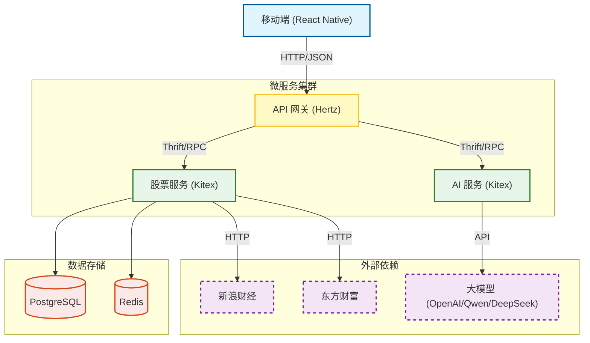
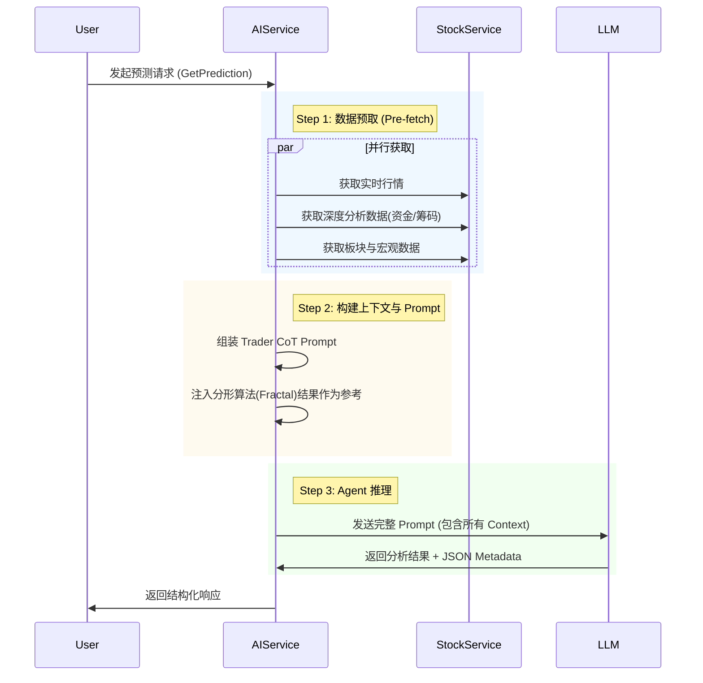

# Stock Assistant (股票助手)

Stock Assistant 是一款专为个人 A 股投资者设计的智能监控与分析工具。它结合了实时行情数据和先进的 AI 模型，帮助用户实时掌握市场动态，提供智能化的投资决策支持。

## 核心功能

*   **实时监控**: 支持 A 股实时行情查看，包括个股价格、涨跌幅、成交量等。
*   **AI 智能预测**: 结合多源新闻资讯和历史数据，利用 LLM（GPT-4o, Qwen, DeepSeek 等）预测短期走势。
*   **市场深度分析**:
    *   **每日总结**: 自动生成大盘及板块热点日报。
    *   **龙虎榜分析**: 追踪机构与游资动向，解析资金流向。
    *   **涨停池监控**: 实时捕捉涨停股票，分析涨停原因及封单强度。
*   **智能辅助工具**:
    *   **图片识别**: 支持拍照识别股票代码，快速添加自选。
    *   **财报分析**: 可视化展示营收、净利润等核心财务指标。
*   **数据同步**: 支持轻量级用户系统，实现多设备间自选股同步。

## 技术架构

本项目采用前后端分离的架构，后端基于 CloudWeGo 微服务体系构建。

### 架构图



### 技术栈详情

*   **移动端**: 
    *   React Native (TypeScript)
    *   React Navigation, React Native Paper
*   **后端**:
    *   **语言**: Go (Golang)
    *   **Web 框架**: Hertz (HTTP 网关)
    *   **RPC 框架**: Kitex (微服务通信)
    *   **AI 框架**: LangChainGo
*   **基础设施**:
    *   Docker & Docker Compose

## Agent 架构设计 (v1.0)

> 本章节记录当前的 Agent 架构设计，作为后续多 Agent 协作升级的基准（Baseline）。

当前 AI 服务采用基于 **LangChainGo** 的 **Single-Agent ReAct** 模式，结合**上下文预取（Context Injection）**策略，以解决金融场景下对时效性和数据准确性的高要求。

### 1. 核心模式

*   **混合驱动 (Hybrid Approach)**:
    *   **预取层 (Pre-fetch Layer)**: 在调用 LLM 之前，系统会并行获取股票实时行情、盘口数据、资金流向、行业板块效应、龙虎榜历史等关键数据。
    *   **推理层 (Reasoning Layer)**: 将预取的数据作为 "Context" 注入到 Prompt 中，配合 `ZeroShotReactDescription` Agent，使 LLM 专注于分析而非繁琐的数据检索。
*   **思维链 (Chain of Thought)**: 
    *   Prompt 中内嵌了专业的 "交易员思维模型"，强制 LLM 按照 `时间背景 -> 宏观/政策 -> 资金/筹码 -> 情绪 -> 风控 -> 预测` 的逻辑路径进行推理。

### 2. 组件设计

#### LLM Provider (`LangChainProvider`)
*   **多模型支持**: 统一封装了 OpenAI, Qwen, DeepSeek 等模型接口。
*   **结构化输出**: 强制要求 LLM 在自然语言分析后，输出 JSON 格式的 Metadata（包含置信度、新闻摘要），以便前端结构化展示。

#### 工具集 (Tools)
虽然使用了预取策略，Agent 仍被赋予了以下工具以应对动态查询需求：
*   `StockPriceTool`: 获取实时 Level-1 行情。
*   `StockAnalysisTool`: 获取深度数据（盘口买卖队列、筹码分布、监管问询函、股吧热度）。
*   `MarketInfoTool`: 聚合新闻资讯、市场情绪和政策面消息。
*   `SectorTool`: 查询板块涨跌幅及资金流向。
*   `DragonTigerTool`: 查询龙虎榜席位数据。

### 3. 数据流向 (Workflow)



### 4. 当前局限与演进方向
*   **当前局限**:
    *   **单视角**: 仅有一个 "交易员" 角色，缺乏多空辩论（Bull vs Bear）。
    *   **静态流程**: 预取逻辑是硬编码的，无法根据问题动态调整数据获取策略。
*   **演进方向 (v2.0)**:
    *   引入 **Multi-Agent Collaboration** (多智能体协作)。
    *   拆分角色：数据分析员 (Data Analyst)、基本面研究员 (Fundamental Researcher)、技术面交易员 (Technical Trader)、风控官 (Risk Officer)。
    *   引入 **Manager Agent** 进行最终决策汇总。

## 目录结构

```
.
├── backend/                # 后端微服务代码
│   ├── gateway/            # API 网关 (Hertz)
│   ├── stock_service/      # 股票数据服务 (Kitex)
│   └── ai_service/         # AI 分析服务 (Kitex)
├── mobile/                 # React Native 移动端代码
├── idl/                    # Thrift 接口定义
├── infrastructure/         # 基础设施配置 (Docker Compose)
└── openspec/               # 项目规范与变更记录
```

## 快速开始

### 环境要求

*   Go >= 1.24
*   Node.js >= 18
*   Docker & Docker Compose

### 启动服务

1.  **启动基础设施**:
    ```bash
    cd infrastructure
    docker-compose up -d
    ```

2.  **运行后端服务**:
    可以使用提供的脚本一键启动：
    ```bash
    ./start_services.sh
    ```

3.  **运行移动端**:
    ```bash
    cd mobile
    npm install
    npm start
    ```

## 贡献指南

请参考 [openspec/project.md](openspec/project.md) 了解详细的项目规范和开发流程。
