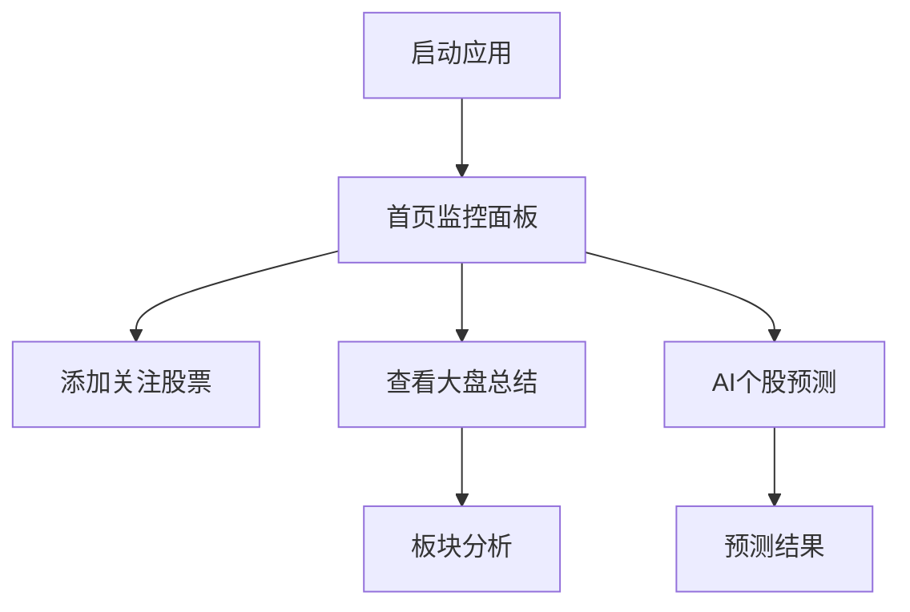

## 1. 产品概述
股票助手是一款专为个人A股投资者设计的智能监控和分析工具，帮助用户实时掌握市场动态，及时捕捉投资机会。
通过实时监控、智能分析和AI预测，让投资者不错过重要市场变化，做出更明智的投资决策。作为个人使用工具，无需注册登录即可使用所有功能。

## 2. 核心功能

### 2.1 用户角色
本产品为个人专用工具，无需用户注册和登录，所有功能均可直接使用。
应用内所有文案和内容必须使用中文。

### 2.2 功能模块
股票助手包含以下核心功能：
1. **实时监控**：持续跟踪A股股票价格变化
2. **每日总结**：收盘后自动生成大盘表现分析和板块热点
3. **AI预测**：结合新闻资讯和历史数据预测股票短期走势
4. **本地数据**：所有数据本地存储，无需网络同步，保护隐私安全

### 2.3 页面详情
| 页面名称 | 模块名称 | 功能描述 |
|----------|----------|----------|
| 首页 | 股票监控面板 | 显示用户关注股票的实时价格、涨跌幅、成交量等关键指标 |
| 首页 | 快速操作区 | 提供添加股票、查看预测等快捷入口 |
| 大盘总结 | 市场概览 | 展示当日上证指数、深证成指、创业板指等主要指数表现 |
| 大盘总结 | 板块分析 | 列出热点板块、涨跌幅排行、资金流向分析 |
| 个股预测 | 搜索功能 | 支持股票代码、名称搜索，快速定位目标股票 |
| 个股预测 | AI分析 | 显示股票价格预测、支撑压力位、市场情绪分析 |

## 3. 核心流程

### 用户主要操作流程：
1. **首次使用流程**：下载应用 → 添加关注股票
2. **盘后分析流程**：查看大盘总结 → 分析板块热点 → 调整投资组合
3. **预测查询流程**：搜索目标股票 → 获取AI预测 → 参考决策建议

## 4. 用户界面设计

### 4.1 设计风格
- **主色调**：金融蓝 (#1E88E5) 搭配白色背景，体现专业可信
- **强调色**：上涨红 (#F44336) 和下跌绿 (#4CAF50) 符合中国股市习惯
- **按钮样式**：圆角矩形设计，主要操作为实心按钮，次要操作为边框按钮
- **字体选择**：系统默认字体，数字使用等宽字体确保对齐
- **图标风格**：线性图标，简洁明了，符合金融应用调性

### 4.2 页面设计概览
| 页面名称 | 模块名称 | UI元素 |
|----------|----------|--------|
| 首页 | 股票监控面板 | 卡片式布局，每张卡片显示股票名称、当前价格、涨跌幅，使用红绿颜色区分涨跌，支持横向滑动查看更多股票 |
| 首页 | 快速操作区 | 底部固定导航栏，包含首页、预测、总结三个入口，使用图标+文字组合 |
| 大盘总结 | 市场概览 | 顶部显示主要指数卡片，中间为涨跌分布饼图，底部为成交量柱状图 |
| 个股预测 | AI分析 | 分模块展示，包括价格预测区间、关键指标、新闻摘要、风险提示，使用图表直观展示 |

### 4.3 响应式设计
- **移动端优先**：专为Android手机设计，适配6寸以上屏幕
- **横竖屏适配**：竖屏为主，横屏优化图表显示
- **触控优化**：按钮最小点击区域48dp，支持长按快捷操作

### 4.4 数据可视化
- **实时图表**：使用折线图展示股票价格走势，支持手势缩放
- **预测图表**：结合历史数据和预测结果，用不同颜色区分
- **饼图和柱状图**：用于展示板块分布、成交量等统计数据