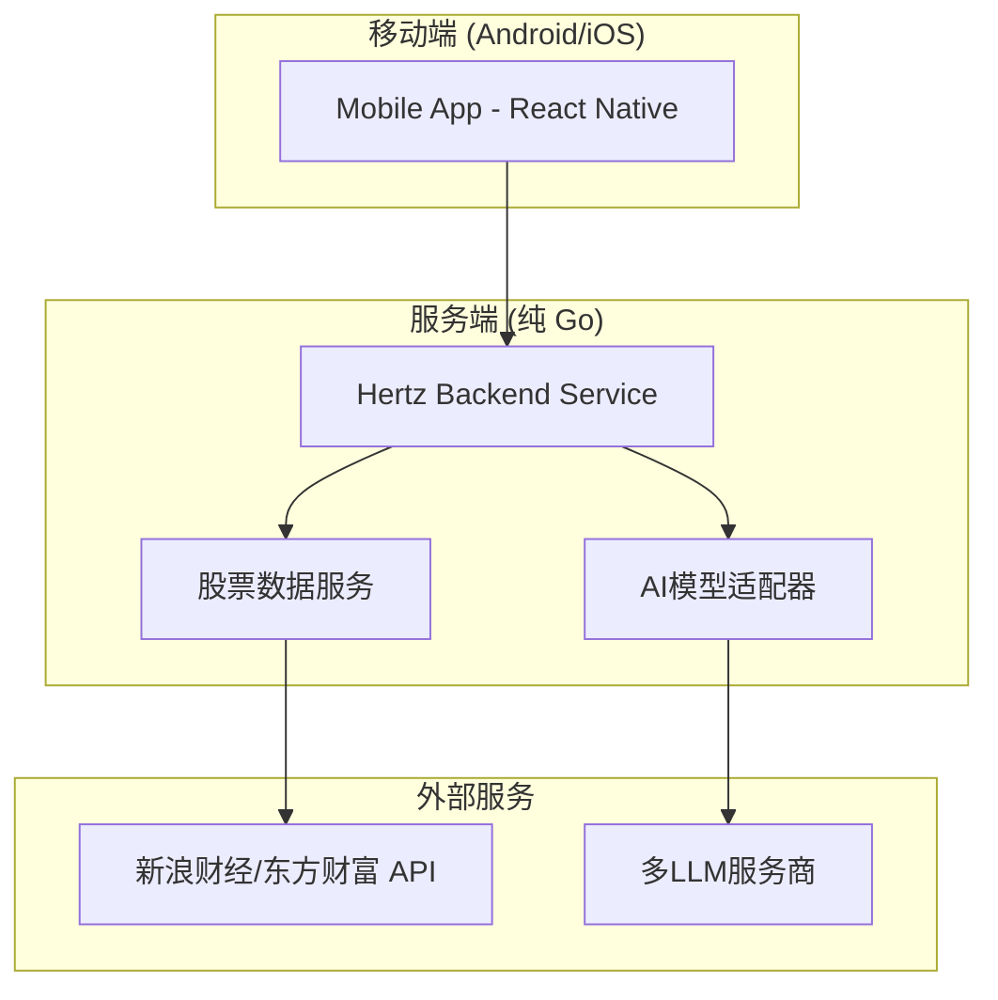
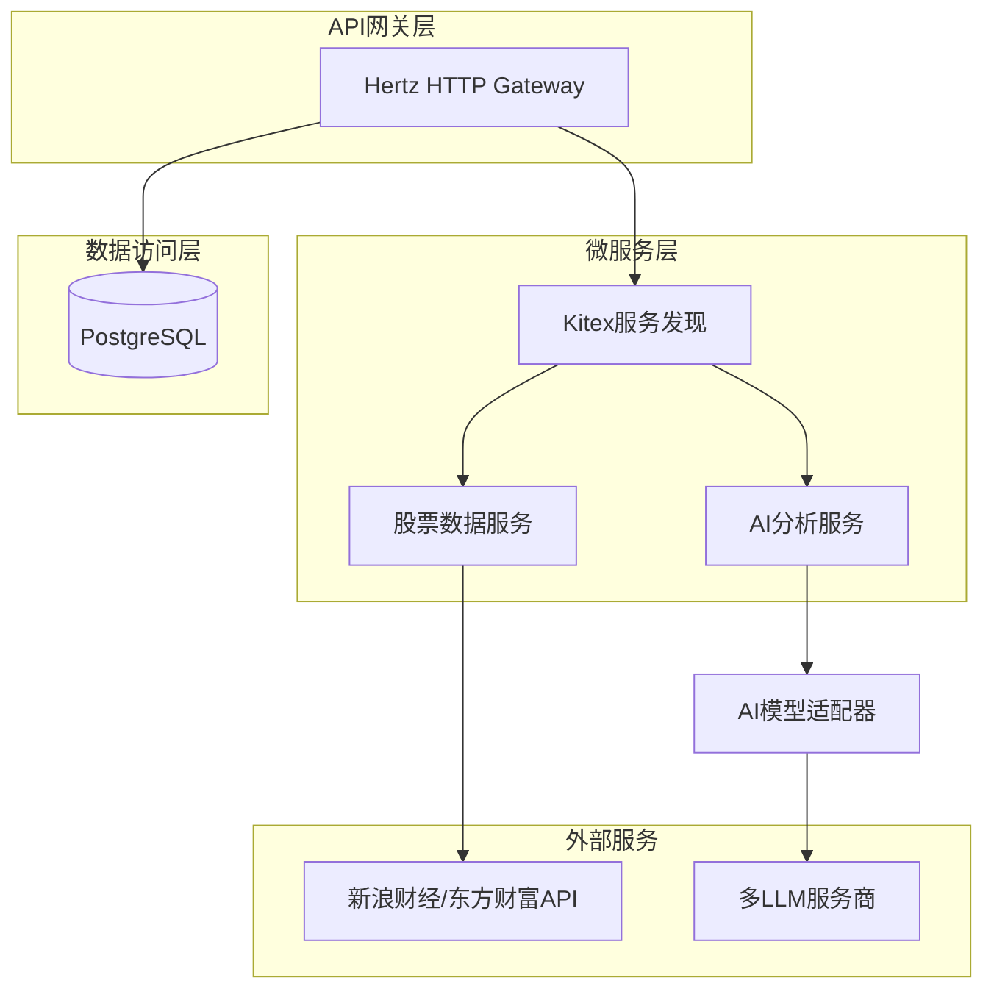
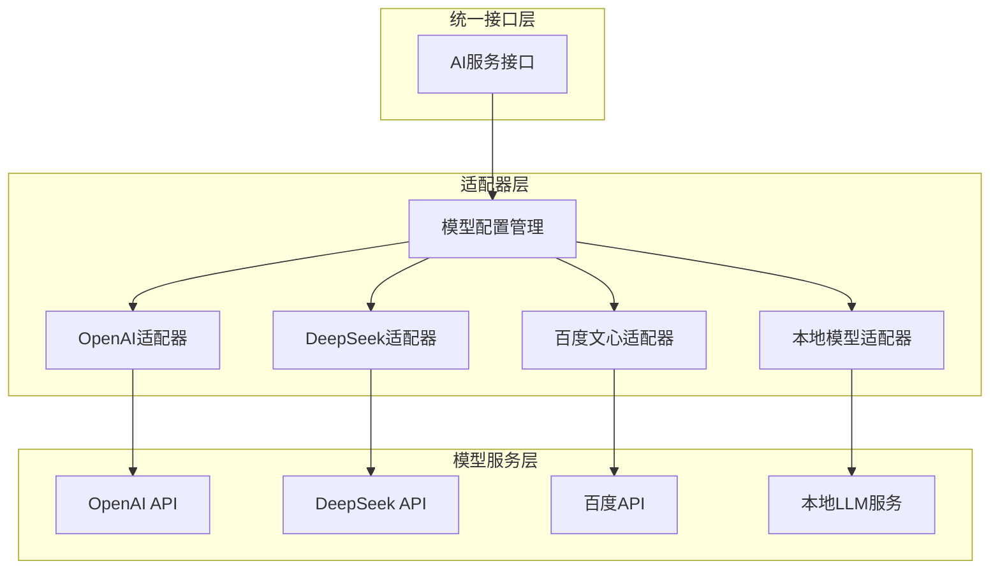
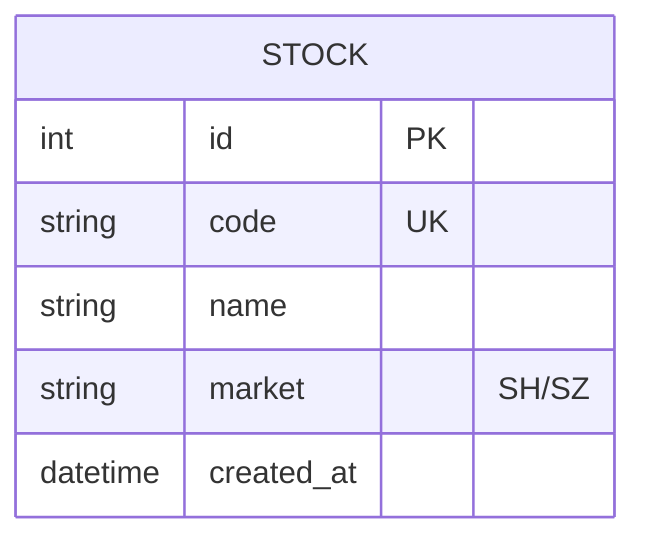

## 1. 架构设计



## 2. 技术描述

### 前端技术栈
- **移动应用**：React Native (支持 Android 和 iOS)
- **编程语言**：TypeScript
- **UI组件库**：React Native Paper 或 NativeBase
- **导航管理**：React Navigation
- **状态管理**：Zustand
- **网络请求**：Axios
- **本地存储**：AsyncStorage (本地数据存储，无需用户账号)

### 后端技术栈
- **服务初始化**：OpenSpec (用于服务定义和初始化，确保标准化)
- **Web框架**：CloudWeGo Hertz (处理HTTP请求和业务逻辑)
- **RPC框架**：CloudWeGo Kitex (微服务间通信)
- **编程语言**：Go 1.21+ (全栈实现)
- **数据源**：Go原生HTTP客户端直接对接新浪财经、东方财富等API
- **AI集成**：Go HTTP客户端直接调用OpenAI、DeepSeek等LLM API
- **数据存储**：PostgreSQL (主数据库) + Redis (缓存)

## 3. 路由定义

### 后端API路由
| 路由 | 方法 | 用途 |
|------|------|------|
| /api/stocks/{code}/realtime | GET | 获取股票实时数据 |
| /api/stocks/{code}/history | GET | 获取股票历史数据 |
| /api/market/summary | GET | 获取大盘总结 |
| /api/market/sectors | GET | 获取板块分析 |
| /api/prediction/{code} | POST | 获取股票预测 |

### 移动端应用页面路由
| 页面 | 路由 | 用途 |
|------|------|------|
| 首页 | /home | 股票监控面板 |
| 预测 | /prediction | 个股预测查询 |
| 总结 | /summary | 大盘总结 |

## 4. API定义

### 4.1 股票相关API

#### 获取实时数据
```
GET /api/stocks/{code}/realtime
```

响应参数：
| 参数名 | 类型 | 描述 |
|--------|------|------|
| code | string | 股票代码 |
| name | string | 股票名称 |
| current_price | float | 当前价格 |
| change_percent | float | 涨跌幅百分比 |
| volume | int | 成交量 |
| timestamp | datetime | 数据时间戳 |

#### 获取股票预测
```
POST /api/prediction/{code}
```

请求体：
```json
{
  "days": 3,
  "include_news": true
}
```

响应参数：
| 参数名 | 类型 | 描述 |
|--------|------|------|
| code | string | 股票代码 |
| prediction | object | 预测结果 |
| confidence | float | 预测置信度 |
| analysis | string | 分析报告 |
| news_summary | string | 相关新闻摘要 |


## 5. 服务端架构设计

### 5.1 整体架构



### 5.2 AI模型适配器设计



### 5.2 核心服务模块

#### AI分析服务 (Kitex)
- **动态模型选择**：根据配置和成本自动选择最优AI模型
- **新闻搜索**：使用搜索引擎API获取相关新闻
- **情感分析**：对新闻内容进行情感倾向分析
- **价格预测**：结合历史数据、新闻情感、技术指标进行预测
- **失败降级**：主模型失败时自动切换到备用模型

#### 股票数据服务 (Kitex)
- **Go原生HTTP客户端**：直接调用新浪财经、东方财富等API获取股票数据
- **数据缓存**：缓存常用股票数据，提高响应速度
- **数据解析**：将HTML/JSON数据解析为统一的Go结构体
- **异常处理**：处理数据源异常，提供降级数据和错误重试机制

## 6. 数据模型

### 6.1 数据库设计



### 6.2 数据定义语言

#### 股票表
```sql
CREATE TABLE stocks (
    id INTEGER PRIMARY KEY AUTOINCREMENT,
    code VARCHAR(10) UNIQUE NOT NULL,
    name VARCHAR(50) NOT NULL,
    market VARCHAR(10) CHECK (market IN ('SH', 'SZ')),
    created_at TIMESTAMP DEFAULT CURRENT_TIMESTAMP
);

CREATE INDEX idx_stocks_code ON stocks(code);
```

## 7. 部署和运维

### 7.1 环境要求
- **Go版本**：1.21+
- **系统依赖**：Linux服务器，4GB+内存
- **网络要求**：能够访问A股数据源和AI服务API
- **容器化**：支持Docker容器化部署

### 7.2 监控和日志
- **应用监控**：使用Prometheus + Grafana监控服务状态，Kitex内置指标
- **链路追踪**：集成OpenTelemetry进行分布式链路追踪
- **日志管理**：使用Zap结构化日志，支持错误追踪和性能分析
- **告警机制**：服务异常时通过短信/邮件通知运维人员

### 7.3 性能优化
- **数据缓存**：Redis缓存热点股票数据，减少数据源访问
- **数据库优化**：合理索引设计，读写分离，定期清理历史数据
- **并发处理**：使用Go协程池处理多个股票监控任务
- **服务网格**：支持服务间负载均衡和熔断机制

### 7.4 开发规范
- **服务初始化**：使用 `openspec` 工具初始化所有服务，确保项目结构统一。
- **禁止内部依赖**：前端和后端服务及所有依赖库必须使用开源版本（如 `github.com/cloudwego/kitex`, `npm` 公共仓库），严禁引入任何字节跳动内部依赖包（`code.byted.org/...` 或内部 npm 源）。
- **代码生成**：使用 `openspec` 或官方开源的 `kitex` 和 `thriftgo` 工具生成代码，确保生成代码中不包含内部包引用。
- **业务逻辑改动**：所有业务逻辑的改动如果会影响到接口返回，则需要通过本地测试验证，确保功能正常运行。

